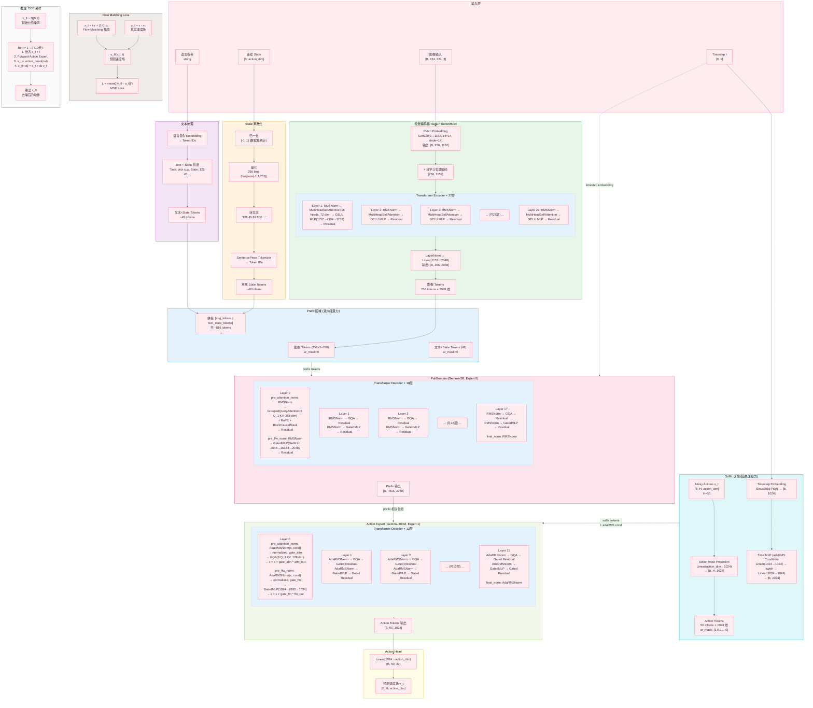
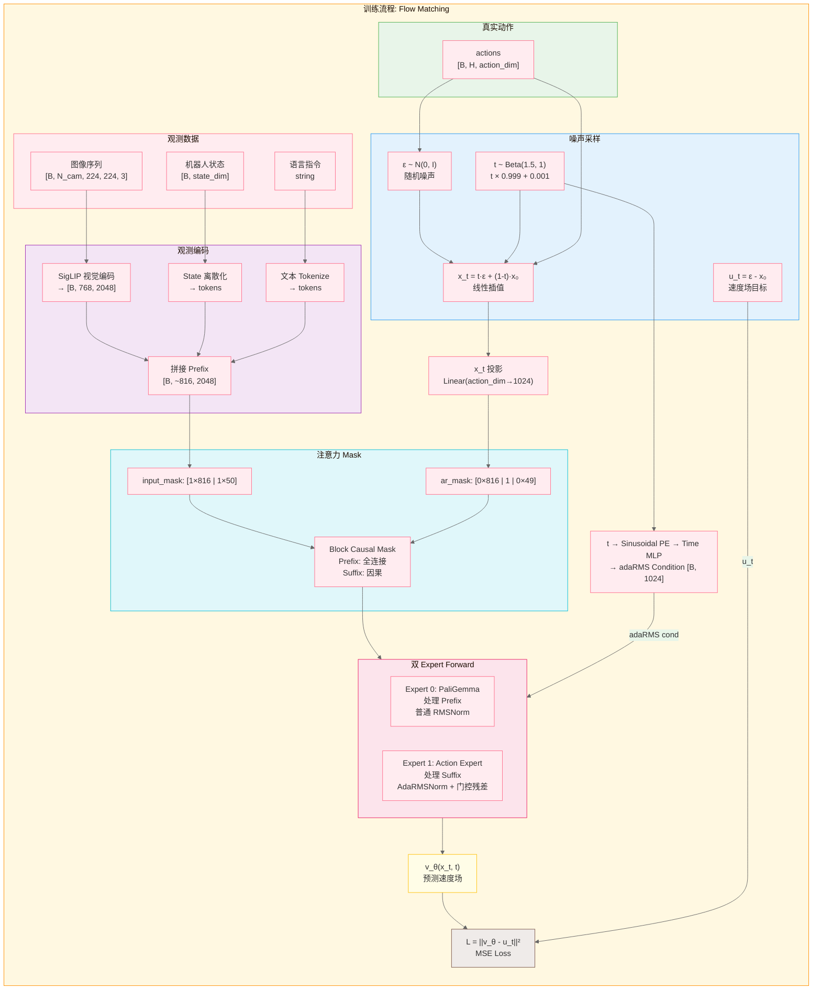
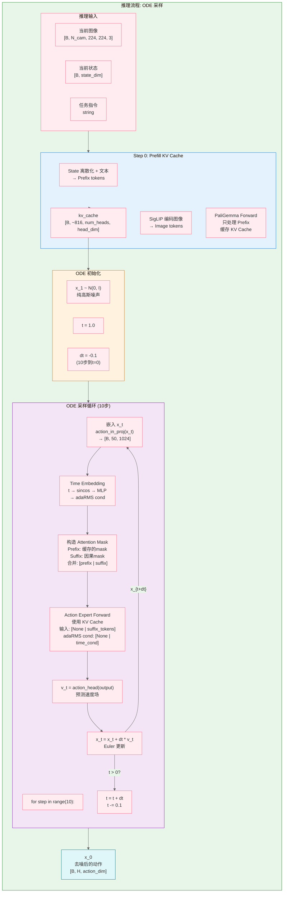
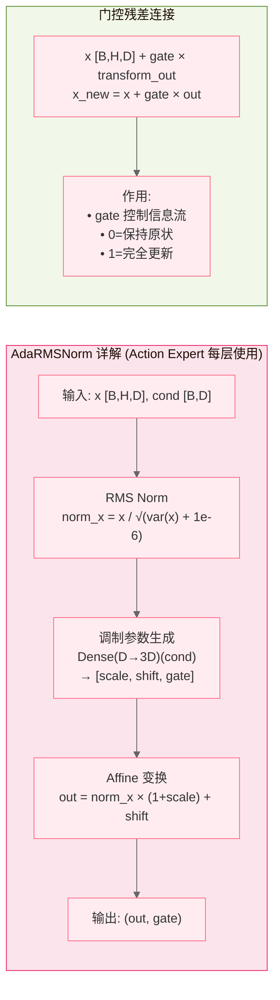
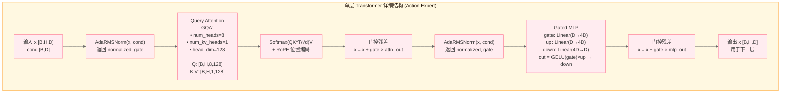
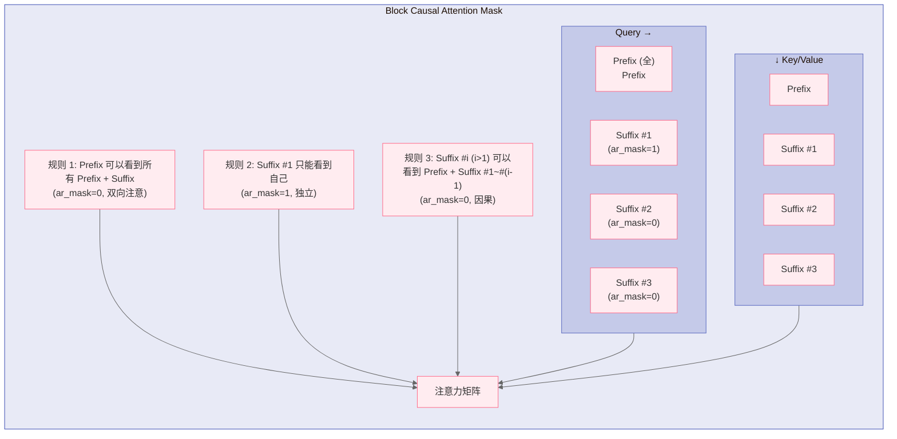

```mermaid
%%{init: {'theme': 'base', 'themeVariables': { 'primaryColor': '#ffecf0', 'primaryTextColor': '#333', 'primaryBorderColor': '#ff6b8a', 'lineColor': '#666', 'secondaryColor': '#e8f5e9', 'tertiaryColor': '#e3f2fd'}}}%%
flowchart TB
    subgraph INPUT["输入层"]
        direction TB
        IMG["图像输入<br/>[B, 224, 224, 3]"]
        STATE["连续 State<br/>[B, action_dim]"]
        TEXT["语言指令<br/>string"]
        TIME["Timestep t<br/>[0, 1]"]
    end

    subgraph VISION["视觉编码器: SigLIP So400m/14"]
        direction TB
        V1["Patch Embedding<br/>Conv2d(3→1152, 14×14, stride=14)<br/>输出: [B, 256, 1152]"]
        V2["+ 可学习位置编码<br/>[256, 1152]"]

        subgraph V_TRANS["Transformer Encoder × 27层"]
            direction TB
            V_LAYER_1["Layer 1: RMSNorm → MultiHeadSelfAttention(16 heads, 72 dim) → GELU MLP(1152→4304→1152) → Residual"]
            V_LAYER_2["Layer 2: RMSNorm → MultiHeadSelfAttention → GELU MLP → Residual"]
            V_LAYER_3["Layer 3: RMSNorm → MultiHeadSelfAttention → GELU MLP → Residual"]
            V_LAYER_N["... (共27层) ..."]
            V_LAYER_27["Layer 27: RMSNorm → MultiHeadSelfAttention → GELU MLP → Residual"]
        end

        V3["LayerNorm → Linear(1152→2048)<br/>输出: [B, 256, 2048]"]
        V_OUT["图像 Tokens<br/>256 tokens × 2048 维"]
    end

    subgraph STATE_DISCRETE["State 离散化"]
        direction TB
        S1["归一化<br/>[-1, 1] (数据集统计)"]
        S2["量化<br/>256 bins (linspace(-1,1,257))"]
        S3["转文本<br/>'128 45 67 200 ...'"]
        S4["SentencePiece Tokenizer<br/>→ Token IDs"]
        S_OUT["离散 State Tokens<br/>~48 tokens"]
    end

    subgraph TEXT_PROC["文本处理"]
        direction TB
        T1["语言指令 Embedding<br/>→ Token IDs"]
        T2["Text + State 拼接<br/>'Task: pick cup, State: 128 45...;\n'"]
        T_OUT["文本+State Tokens<br/>~48 tokens"]
    end

    subgraph PREFIX["Prefix 区域 (双向注意力)"]
        direction TB
        P1["图像 Tokens (256×3=768)<br/>ar_mask=0"]
        P2["文本+State Tokens (48)<br/>ar_mask=0"]
        P_MERGE["拼接: [img_tokens | text_state_tokens]<br/>共 ~816 tokens"]
    end

    subgraph SUFFIX["Suffix 区域 (因果注意力)"]
        direction TB
        SUF1["Noisy Actions x_t<br/>[B, H, action_dim]<br/>H=50"]
        SUF2["Action Input Projection<br/>Linear(action_dim→1024)<br/>→ [B, H, 1024]"]
        SUF3["Action Tokens<br/>50 tokens × 1024 维<br/>ar_mask: [1,0,0,...,0]"]
        SUF4["Timestep Embedding<br/>Sinusoidal PE(t) → [B, 1024]"]
        SUF5["Time MLP (adaRMS Condition)<br/>Linear(1024→1024) → swish → Linear(1024→1024)<br/>→ [B, 1024]"]
    end

    subgraph PALIGEMMA["PaliGemma (Gemma-2B, Expert 0)"]
        direction TB

        subgraph PALI_LAYERS["Transformer Decoder × 18层"]
            direction TB
            PL_1["Layer 0<br/>pre_attention_norm: RMSNorm<br/>→ GroupedQueryAttention(8 Q, 1 KV, 256 dim)<br/>+ RoPE + BlockCausalMask<br/>→ Residual<br/><br/>pre_ffw_norm: RMSNorm<br/>→ GatedMLP(GeGLU: 2048→16384→2048)<br/>→ Residual"]
            PL_2["Layer 1<br/>RMSNorm → GQA → Residual<br/>RMSNorm → GatedMLP → Residual"]
            PL_3["Layer 2<br/>RMSNorm → GQA → Residual<br/>RMSNorm → GatedMLP → Residual"]
            PL_N["... (共18层) ..."]
            PL_18["Layer 17<br/>RMSNorm → GQA → Residual<br/>RMSNorm → GatedMLP → Residual<br/><br/>final_norm: RMSNorm"]
        end

        PALI_OUT["Prefix 输出<br/>[B, ~816, 2048]"]
    end

    subgraph ACTION_EXPERT["Action Expert (Gemma-300M, Expert 1)"]
        direction TB

        subgraph AE_LAYERS["Transformer Decoder × 12层"]
            direction TB
            AE_1["Layer 0<br/>pre_attention_norm: AdaRMSNorm(x, cond)<br/>→ normalized, gate_attn<br/>→ GQA(8 Q, 1 KV, 128 dim)<br/>→ x = x + gate_attn * attn_out<br/><br/>pre_ffw_norm: AdaRMSNorm(x, cond)<br/>→ normalized, gate_ffn<br/>→ GatedMLP(1024→8192→1024)<br/>→ x = x + gate_ffn * ffn_out"]
            AE_2["Layer 1<br/>AdaRMSNorm → GQA → Gated Residual<br/>AdaRMSNorm → GatedMLP → Gated Residual"]
            AE_3["Layer 2<br/>AdaRMSNorm → GQA → Gated Residual<br/>AdaRMSNorm → GatedMLP → Gated Residual"]
            AE_N["... (共12层) ..."]
            AE_12["Layer 11<br/>AdaRMSNorm → GQA → Gated Residual<br/>AdaRMSNorm → GatedMLP → Gated Residual<br/><br/>final_norm: AdaRMSNorm"]
        end

        AE_OUT["Action Tokens 输出<br/>[B, 50, 1024]"]
    end

    subgraph ACTION_HEAD["Action Head"]
        direction TB
        AH1["Linear(1024→action_dim)<br/>[B, 50, 32]"]
        AH2["预测速度场 v_t<br/>[B, H, action_dim]"]
    end

    subgraph LOSS["Flow Matching Loss"]
        direction TB
        L1["x_t = t·ε + (1-t)·x₀<br/>Flow Matching 插值"]
        L2["u_t = ε - x₀<br/>真实速度场"]
        L3["v_θ(x_t, t)<br/>预测速度场"]
        L4["L = mean(||v_θ - u_t||²)<br/>MSE Loss"]
    end

    subgraph INFERENCE["推理: ODE 采样"]
        direction TB
        I1["x_1 ~ N(0, I)<br/>初始化纯噪声"]
        I2["for t = 1→0 (10步):<br/>1. 嵌入 x_t + t<br/>2. Forward Action Expert<br/>3. v_t = action_head(out)<br/>4. x_{t+dt} = x_t + dt·v_t"]
        I3["输出 x_0<br/>去噪后的动作"]
    end

    %% 连接关系
    IMG --> V1
    V1 --> V2
    V2 --> V_TRANS
    V_TRANS --> V3
    V3 --> V_OUT
    V_OUT --> P1

    STATE --> S1
    S1 --> S2
    S2 --> S3
    S3 --> S4
    S4 --> S_OUT

    TEXT --> T1
    T1 --> T2
    T2 --> T_OUT

    S_OUT --> P_MERGE
    T_OUT --> P_MERGE
    P_MERGE --> PREFIX

    TIME --> SUF4
    SUF4 --> SUF5

    SUF1 --> SUF2
    SUF2 --> SUF3

    TIME -.->|"timestep embedding"| PALIGEMMA
    PREFIX -->|"prefix tokens"| PALIGEMMA
    SUFFIX -->|"suffix tokens<br/>+ adaRMS cond"| ACTION_EXPERT

    PALIGEMMA --> PALI_OUT
    PALI_OUT -->|"prefix 相关信息"| ACTION_EXPERT

    ACTION_EXPERT --> AE_OUT
    AE_OUT --> AH1
    AH1 --> AH2

    L1 --> L3
    L2 --> L3
    L3 --> L4

    I1 --> I2
    I2 --> I3

    style INPUT fill:#ffecf0,stroke:#ff6b8a
    style VISION fill:#e8f5e9,stroke:#4caf50
    style STATE_DISCRETE fill:#fff3e0,stroke:#ff9800
    style TEXT_PROC fill:#f3e5f5,stroke:#9c27b0
    style PREFIX fill:#e3f2fd,stroke:#2196f3
    style SUFFIX fill:#e0f7fa,stroke:#00bcd4
    style PALIGEMMA fill:#fce4ec,stroke:#e91e63
    style ACTION_EXPERT fill:#f1f8e9,stroke:#8bc34a
    style ACTION_HEAD fill:#fffde7,stroke:#ffc107
    style LOSS fill:#efebe9,stroke:#795548
    style INFERENCE fill:#fafafa,stroke:#607d8b
```

```mermaid
%%{init: {'theme': 'base', 'themeVariables': { 'primaryColor': '#ffecf0', 'primaryTextColor': '#333', 'primaryBorderColor': '#ff6b8a', 'lineColor': '#666', 'secondaryColor': '#e8f5e9', 'tertiaryColor': '#e3f2fd'}}}%%
flowchart TB
    subgraph TRAINING["训练流程: Flow Matching"]
        direction TB

        subgraph OBS["观测数据"]
            OB1["图像序列<br/>[B, N_cam, 224, 224, 3]"]
            OB2["机器人状态<br/>[B, state_dim]"]
            OB3["语言指令<br/>string"]
        end

        subgraph GROUND_TRUTH["真实动作"]
            GT1["actions<br/>[B, H, action_dim]"]
        end

        subgraph NOISE_SAMPLE["噪声采样"]
            NS1["ε ~ N(0, I)<br/>随机噪声"]
            NS2["t ~ Beta(1.5, 1)<br/>t × 0.999 + 0.001"]
            NS3["x_t = t·ε + (1-t)·x₀<br/>线性插值"]
            NS4["u_t = ε - x₀<br/>速度场目标"]
        end

        subgraph EMBED_OBS["观测编码"]
            EO1["SigLIP 视觉编码<br/>→ [B, 768, 2048]"]
            EO2["State 离散化<br/>→ tokens"]
            EO3["文本 Tokenize<br/>→ tokens"]
            EO4["拼接 Prefix<br/>[B, ~816, 2048]"]
        end

        EMBED_ACTION["x_t 投影<br/>Linear(action_dim→1024)"]

        TIME_EMB["t → Sinusoidal PE → Time MLP<br/>→ adaRMS Condition [B, 1024]"]

        subgraph ATTN_MASK["注意力 Mask"]
            AM1["input_mask: [1×816 | 1×50]"]
            AM2["ar_mask: [0×816 | 1 | 0×49]"]
            AM3["Block Causal Mask<br/>Prefix: 全连接<br/>Suffix: 因果"]
        end

        subgraph FORWARD["双 Expert Forward"]
            FE1["Expert 0: PaliGemma<br/>处理 Prefix<br/>普通 RMSNorm"]
            FE2["Expert 1: Action Expert<br/>处理 Suffix<br/>AdaRMSNorm + 门控残差"]
        end

        PRED_V["v_θ(x_t, t)<br/>预测速度场"]

        LOSS["L = ||v_θ - u_t||²<br/>MSE Loss"]

        %% 训练连接
        OB1 --> EO1
        OB2 --> EO2
        OB3 --> EO3
        EO1 --> EO4
        EO2 --> EO4
        EO3 --> EO4

        GT1 --> NS1
        NS1 --> NS3
        NS2 --> NS3
        GT1 --> NS3

        NS3 --> EMBED_ACTION
        NS2 --> TIME_EMB

        EO4 --> AM1
        EMBED_ACTION --> AM2
        AM1 --> AM3
        AM2 --> AM3

        AM3 --> FORWARD
        TIME_EMB -->|"adaRMS cond"| FORWARD

        FORWARD --> PRED_V
        PRED_V --> LOSS
        NS4 -->|"u_t"| LOSS
    end

    style TRAINING fill:#fff8e1,stroke:#ff8f00
    style OBS fill:#ffecf0,stroke:#ff6b8a
    style GROUND_TRUTH fill:#e8f5e9,stroke:#4caf50
    style NOISE_SAMPLE fill:#e3f2fd,stroke:#2196f3
    style EMBED_OBS fill:#f3e5f5,stroke:#9c27b0
    style ATTN_MASK fill:#e0f7fa,stroke:#00bcd4
    style FORWARD fill:#fce4ec,stroke:#e91e63
    style PRED_V fill:#fffde7,stroke:#ffc107
    style LOSS fill:#efebe9,stroke:#795548
```

```mermaid
%%{init: {'theme': 'base', 'themeVariables': { 'primaryColor': '#ffecf0', 'primaryTextColor': '#333', 'primaryBorderColor': '#ff6b8a', 'lineColor': '#666', 'secondaryColor': '#e8f5e9', 'tertiaryColor': '#e3f2fd'}}}%%
flowchart TB
    subgraph INFERENCE["推理流程: ODE 采样"]
        direction TB

        subgraph INPUT_INF["推理输入"]
            II1["当前图像<br/>[B, N_cam, 224, 224, 3]"]
            II2["当前状态<br/>[B, state_dim]"]
            II3["任务指令<br/>string"]
        end

        subgraph PREFILL["Step 0: Prefill KV Cache"]
            PC1["State 离散化 + 文本<br/>→ Prefix tokens"]
            PC2["SigLIP 编码图像<br/>→ Image tokens"]
            PC3["PaliGemma Forward<br/>只处理 Prefix<br/>缓存 KV Cache"]
            PC4["kv_cache<br/>[B, ~816, num_heads, head_dim]"]
        end

        subgraph ODE_INIT["ODE 初始化"]
            OI1["x_1 ~ N(0, I)<br/>纯高斯噪声"]
            OI2["t = 1.0"]
            OI3["dt = -0.1<br/>(10步到t=0)"]
        end

        subgraph ODE_STEP["ODE 采样循环 (10步)"]
            direction TB
            OS_ITER["for step in range(10):"]

            OS1["嵌入 x_t<br/>action_in_proj(x_t)<br/>→ [B, 50, 1024]"]

            OS2["Time Embedding<br/>t → sincos → MLP<br/>→ adaRMS cond"]

            OS3["构造 Attention Mask<br/>Prefix: 缓存的mask<br/>Suffix: 因果mask<br/>合并: [prefix | suffix]"]

            OS4["Action Expert Forward<br/>使用 KV Cache<br/>输入: [None | suffix_tokens]<br/>adaRMS cond: [None | time_cond]"]

            OS5["v_t = action_head(output)<br/>预测速度场"]

            OS6["x_t = x_t + dt * v_t<br/>Euler 更新"]

            OS7["t = t + dt<br/>t -= 0.1"]
        end

        OUTPUT_ACT["x_0<br/>去噪后的动作<br/>[B, H, action_dim]"]

        %% 连接
        INPUT_INF --> PREFILL
        PREFILL --> PC4

        PC4 --> ODE_INIT
        ODE_INIT --> ODE_STEP

        OS1 --> OS2
        OS2 --> OS3
        OS3 --> OS4
        OS4 --> OS5
        OS5 --> OS6
        OS6 -->|"x_{t+dt}"| OS1
        OS6 -->|"t > 0?"| OS7

        ODE_STEP --> OUTPUT_ACT
    end

    style INFERENCE fill:#e8f5e9,stroke:#2e7d32
    style INPUT_INF fill:#ffecf0,stroke:#ff6b8a
    style PREFILL fill:#e3f2fd,stroke:#1976d2
    style ODE_INIT fill:#fff3e0,stroke:#ef6c00
    style ODE_STEP fill:#f3e5f5,stroke:#7b1fa2
    style OUTPUT_ACT fill:#e0f7fa,stroke:#00838f
```

```mermaid
%%{init: {'theme': 'base', 'themeVariables': { 'primaryColor': '#ffecf0', 'primaryTextColor': '#333', 'primaryBorderColor': '#ff6b8a', 'lineColor': '#666', 'secondaryColor': '#e8f5e9', 'tertiaryColor': '#e3f2fd'}}}%%
flowchart LR
    subgraph ADArms["AdaRMSNorm 详解 (Action Expert 每层使用)"]
        direction TB

        ARM1["输入: x [B,H,D], cond [B,D]"]
        ARM2["RMS Norm<br/>norm_x = x / √(var(x) + 1e-6)"]

        ARM3["调制参数生成<br/>Dense(D→3D)(cond)<br/>→ [scale, shift, gate]"]

        ARM4["Affine 变换<br/>out = norm_x × (1+scale) + shift"]

        ARM5["输出: (out, gate)"]
    end

    subgraph GATED_RES["门控残差连接"]
        direction TB

        GR1["x [B,H,D] + gate × transform_out<br/>x_new = x + gate × out"]

        GR2["作用:<br/>• gate 控制信息流<br/>• 0=保持原状<br/>• 1=完全更新"]
    end

    ARM1 --> ARM2 --> ARM3 --> ARM4 --> ARM5
    GR1 --> GR2

    style ADArms fill:#fce4ec,stroke:#e91e63
    style GATED_RES fill:#f1f8e9,stroke:#558b2f
```

```mermaid
%%{init: {'theme': 'base', 'themeVariables': { 'primaryColor': '#ffecf0', 'primaryTextColor': '#333', 'primaryBorderColor': '#ff6b8a', 'lineColor': '#666', 'secondaryColor': '#e8f5e9', 'tertiaryColor': '#e3f2fd'}}}%%
flowchart LR
    subgraph LAYER_DETAIL["单层 Transformer 详细结构 (Action Expert)"]
        direction LR

        LD1["输入 x [B,H,D]<br/>cond [B,D]"]

        LD2["AdaRMSNorm(x, cond)<br/>返回 normalized, gate"]

        LD3["Query Attention<br/>GQA:<br/>• num_heads=8<br/>• num_kv_heads=1<br/>• head_dim=128<br/><br/>Q: [B,H,8,128]<br/>K,V: [B,H,1,128]"]

        LD4["Softmax(QK^T/√d)V<br/>+ RoPE 位置编码"]

        LD5["门控残差<br/>x = x + gate × attn_out"]

        LD6["AdaRMSNorm(x, cond)<br/>返回 normalized, gate"]

        LD7["Gated MLP<br/>gate: Linear(D→4D)<br/>up: Linear(D→4D)<br/>down: Linear(4D→D)<br/>out = GELU(gate)×up → down"]

        LD8["门控残差<br/>x = x + gate × mlp_out"]

        LD9["输出 x [B,H,D]<br/>用于下一层"]

        LD1 --> LD2 --> LD3 --> LD4 --> LD5 --> LD6 --> LD7 --> LD8 --> LD9
    end

    style LAYER_DETAIL fill:#fff8e1,stroke:#ff8f00
```

```mermaid
%% 注意力 Mask 机制
%%{init: {'theme': 'base', 'themeVariables': { 'primaryColor': '#ffecf0', 'primaryTextColor': '#333', 'primaryBorderColor': '#ff6b8a', 'lineColor': '#666', 'secondaryColor': '#e8f5e9', 'tertiaryColor': '#e3f2fd'}}}%%
flowchart TB
    subgraph ATTN_MECH["Block Causal Attention Mask"]
        direction TB

        AM_MATRIX["注意力矩阵"]

        subgraph MATRIX_SHOW["Query →"]
            ROW1["Prefix (全)<br/>Prefix"]
            ROW2["Suffix #1<br/>(ar_mask=1)"]
            ROW3["Suffix #2<br/>(ar_mask=0)"]
            ROW4["Suffix #3<br/>(ar_mask=0)"]
        end

        subgraph COLS["↓ Key/Value"]
            COL1["Prefix"]
            COL2["Suffix #1"]
            COL3["Suffix #2"]
            COL4["Suffix #3"]
        end

        RULE1["规则 1: Prefix 可以看到所有 Prefix + Suffix<br/>(ar_mask=0, 双向注意)"]
        RULE2["规则 2: Suffix #1 只能看到自己<br/>(ar_mask=1, 独立)"]
        RULE3["规则 3: Suffix #i (i>1) 可以看到 Prefix + Suffix #1~#(i-1)<br/>(ar_mask=0, 因果)"]

        MATRIX_SHOW --> AM_MATRIX
        COLS --> AM_MATRIX
        RULE1 --> AM_MATRIX
        RULE2 --> AM_MATRIX
        RULE3 --> AM_MATRIX
    end

    style ATTN_MECH fill:#e8eaf6,stroke:#3f51b5
    style MATRIX_SHOW fill:#c5cae9,stroke:#5c6bc0
    style COLS fill:#c5cae9,stroke:#5c6bc0
```
