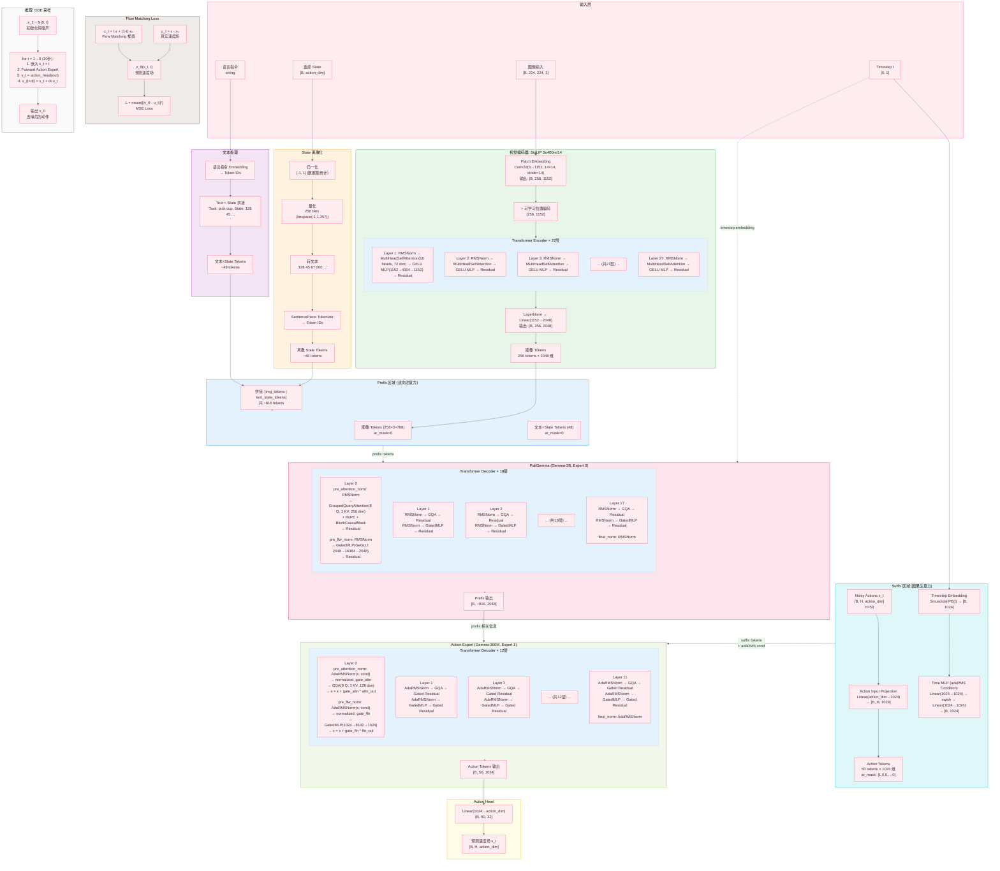

```mermaid
%%{init: {'theme': 'base', 'themeVariables': { 'primaryColor': '#ffecf0', 'primaryTextColor': '#333', 'primaryBorderColor': '#ff6b8a', 'lineColor': '#666', 'secondaryColor': '#e8f5e9', 'tertiaryColor': '#e3f2fd'}}}%%
flowchart TB
    subgraph INPUT["输入层"]
        direction TB
        IMG["图像输入<br/>[B, 224, 224, 3]"]
        STATE["连续 State<br/>[B, action_dim]"]
        TEXT["语言指令<br/>string"]
        TIME["Timestep t<br/>[0, 1]"]
    end

    subgraph VISION["视觉编码器: SigLIP So400m/14"]
        direction TB
        V1["Patch Embedding<br/>Conv2d(3→1152, 14×14, stride=14)<br/>输出: [B, 256, 1152]"]
        V2["+ 可学习位置编码<br/>[256, 1152]"]

        subgraph V_TRANS["Transformer Encoder × 27层"]
            direction TB
            V_LAYER_1["Layer 1: RMSNorm → MultiHeadSelfAttention(16 heads, 72 dim) → GELU MLP(1152→4304→1152) → Residual"]
            V_LAYER_2["Layer 2: RMSNorm → MultiHeadSelfAttention → GELU MLP → Residual"]
            V_LAYER_3["Layer 3: RMSNorm → MultiHeadSelfAttention → GELU MLP → Residual"]
            V_LAYER_N["... (共27层) ..."]
            V_LAYER_27["Layer 27: RMSNorm → MultiHeadSelfAttention → GELU MLP → Residual"]
        end

        V3["LayerNorm → Linear(1152→2048)<br/>输出: [B, 256, 2048]"]
        V_OUT["图像 Tokens<br/>256 tokens × 2048 维"]
    end

    subgraph STATE_DISCRETE["State 离散化"]
        direction TB
        S1["归一化<br/>[-1, 1] (数据集统计)"]
        S2["量化<br/>256 bins (linspace(-1,1,257))"]
        S3["转文本<br/>'128 45 67 200 ...'"]
        S4["SentencePiece Tokenizer<br/>→ Token IDs"]
        S_OUT["离散 State Tokens<br/>~48 tokens"]
    end

    subgraph TEXT_PROC["文本处理"]
        direction TB
        T1["语言指令 Embedding<br/>→ Token IDs"]
        T2["Text + State 拼接<br/>'Task: pick cup, State: 128 45...;<br/>'"]
        T_OUT["文本+State Tokens<br/>~48 tokens"]
    end

    subgraph PREFIX["Prefix 区域 (双向注意力)"]
        direction TB
        P1["图像 Tokens (256×3=768)<br/>ar_mask=0"]
        P2["文本+State Tokens (48)<br/>ar_mask=0"]
        P_MERGE["拼接: [img_tokens | text_state_tokens]<br/>共 ~816 tokens"]
    end

    subgraph SUFFIX["Suffix 区域 (因果注意力)"]
        direction TB
        SUF1["Noisy Actions x_t<br/>[B, H, action_dim]<br/>H=50"]
        SUF2["Action Input Projection<br/>Linear(action_dim→1024)<br/>→ [B, H, 1024]"]
        SUF3["Action Tokens<br/>50 tokens × 1024 维<br/>ar_mask: [1,0,0,...,0]"]
        SUF4["Timestep Embedding<br/>Sinusoidal PE(t) → [B, 1024]"]
        SUF5["Time MLP (adaRMS Condition)<br/>Linear(1024→1024) → swish → Linear(1024→1024)<br/>→ [B, 1024]"]
    end

    subgraph PALIGEMMA["PaliGemma (Gemma-2B, Expert 0)"]
        direction TB

        subgraph PALI_LAYERS["Transformer Decoder × 18层"]
            direction TB
            PL_1["Layer 0<br/>pre_attention_norm: RMSNorm<br/>→ GroupedQueryAttention(8 Q, 1 KV, 256 dim)<br/>+ RoPE + BlockCausalMask<br/>→ Residual<br/><br/>pre_ffw_norm: RMSNorm<br/>→ GatedMLP(GeGLU: 2048→16384→2048)<br/>→ Residual"]
            PL_2["Layer 1<br/>RMSNorm → GQA → Residual<br/>RMSNorm → GatedMLP → Residual"]
            PL_3["Layer 2<br/>RMSNorm → GQA → Residual<br/>RMSNorm → GatedMLP → Residual"]
            PL_N["... (共18层) ..."]
            PL_18["Layer 17<br/>RMSNorm → GQA → Residual<br/>RMSNorm → GatedMLP → Residual<br/><br/>final_norm: RMSNorm"]
        end

        PALI_OUT["Prefix 输出<br/>[B, ~816, 2048]"]
    end

    subgraph ACTION_EXPERT["Action Expert (Gemma-300M, Expert 1)"]
        direction TB

        subgraph AE_LAYERS["Transformer Decoder × 12层"]
            direction TB
            AE_1["Layer 0<br/>pre_attention_norm: AdaRMSNorm(x, cond)<br/>→ normalized, gate_attn<br/>→ GQA(8 Q, 1 KV, 128 dim)<br/>→ x = x + gate_attn * attn_out<br/><br/>pre_ffw_norm: AdaRMSNorm(x, cond)<br/>→ normalized, gate_ffn<br/>→ GatedMLP(1024→8192→1024)<br/>→ x = x + gate_ffn * ffn_out"]
            AE_2["Layer 1<br/>AdaRMSNorm → GQA → Gated Residual<br/>AdaRMSNorm → GatedMLP → Gated Residual"]
            AE_3["Layer 2<br/>AdaRMSNorm → GQA → Gated Residual<br/>AdaRMSNorm → GatedMLP → Gated Residual"]
            AE_N["... (共12层) ..."]
            AE_12["Layer 11<br/>AdaRMSNorm → GQA → Gated Residual<br/>AdaRMSNorm → GatedMLP → Gated Residual<br/><br/>final_norm: AdaRMSNorm"]
        end

        AE_OUT["Action Tokens 输出<br/>[B, 50, 1024]"]
    end

    subgraph ACTION_HEAD["Action Head"]
        direction TB
        AH1["Linear(1024→action_dim)<br/>[B, 50, 32]"]
        AH2["预测速度场 v_t<br/>[B, H, action_dim]"]
    end

    subgraph LOSS["Flow Matching Loss"]
        direction TB
        L1["x_t = t·ε + (1-t)·x₀<br/>Flow Matching 插值"]
        L2["u_t = ε - x₀<br/>真实速度场"]
        L3["v_θ(x_t, t)<br/>预测速度场"]
        L4["L = mean(||v_θ - u_t||²)<br/>MSE Loss"]
    end

    subgraph INFERENCE["推理: ODE 采样"]
        direction TB
        I1["x_1 ~ N(0, I)<br/>初始化纯噪声"]
        I2["for t = 1→0 (10步):<br/>1. 嵌入 x_t + t<br/>2. Forward Action Expert<br/>3. v_t = action_head(out)<br/>4. x_{t+dt} = x_t + dt·v_t"]
        I3["输出 x_0<br/>去噪后的动作"]
    end

    IMG --> V1
    V1 --> V2
    V2 --> V_TRANS
    V_TRANS --> V3
    V3 --> V_OUT
    V_OUT --> P1

    STATE --> S1
    S1 --> S2
    S2 --> S3
    S3 --> S4
    S4 --> S_OUT

    TEXT --> T1
    T1 --> T2
    T2 --> T_OUT

    S_OUT --> P_MERGE
    T_OUT --> P_MERGE
    P_MERGE --> PREFIX

    TIME --> SUF4
    SUF4 --> SUF5

    SUF1 --> SUF2
    SUF2 --> SUF3

    TIME -.->|"timestep embedding"| PALIGEMMA
    PREFIX -->|"prefix tokens"| PALIGEMMA
    SUFFIX -->|"suffix tokens<br/>+ adaRMS cond"| ACTION_EXPERT

    PALIGEMMA --> PALI_OUT
    PALI_OUT -->|"prefix 相关信息"| ACTION_EXPERT

    ACTION_EXPERT --> AE_OUT
    AE_OUT --> AH1
    AH1 --> AH2

    L1 --> L3
    L2 --> L3
    L3 --> L4

    I1 --> I2
    I2 --> I3

    style INPUT fill:#ffecf0,stroke:#ff6b8a
    style VISION fill:#e8f5e9,stroke:#4caf50
    style STATE_DISCRETE fill:#fff3e0,stroke:#ff9800
    style TEXT_PROC fill:#f3e5f5,stroke:#9c27b0
    style PREFIX fill:#e3f2fd,stroke:#2196f3
    style SUFFIX fill:#e0f7fa,stroke:#00bcd4
    style PALIGEMMA fill:#fce4ec,stroke:#e91e63
    style ACTION_EXPERT fill:#f1f8e9,stroke:#8bc34a
    style ACTION_HEAD fill:#fffde7,stroke:#ffc107
    style LOSS fill:#efebe9,stroke:#795548
    style INFERENCE fill:#fafafa,stroke:#607d8b
```
