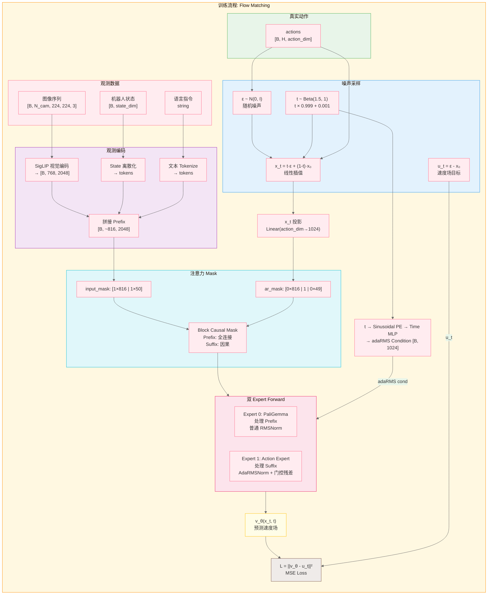

```mermaid
%%{init: {'theme': 'base', 'themeVariables': { 'primaryColor': '#ffecf0', 'primaryTextColor': '#333', 'primaryBorderColor': '#ff6b8a', 'lineColor': '#666', 'secondaryColor': '#e8f5e9', 'tertiaryColor': '#e3f2fd'}}}%%
flowchart TB
    subgraph TRAINING["训练流程: Flow Matching"]
        direction TB

        subgraph OBS["观测数据"]
            OB1["图像序列<br/>[B, N_cam, 224, 224, 3]"]
            OB2["机器人状态<br/>[B, state_dim]"]
            OB3["语言指令<br/>string"]
        end

        subgraph GROUND_TRUTH["真实动作"]
            GT1["actions<br/>[B, H, action_dim]"]
        end

        subgraph NOISE_SAMPLE["噪声采样"]
            NS1["ε ~ N(0, I)<br/>随机噪声"]
            NS2["t ~ Beta(1.5, 1)<br/>t × 0.999 + 0.001"]
            NS3["x_t = t·ε + (1-t)·x₀<br/>线性插值"]
            NS4["u_t = ε - x₀<br/>速度场目标"]
        end

        subgraph EMBED_OBS["观测编码"]
            EO1["SigLIP 视觉编码<br/>→ [B, 768, 2048]"]
            EO2["State 离散化<br/>→ tokens"]
            EO3["文本 Tokenize<br/>→ tokens"]
            EO4["拼接 Prefix<br/>[B, ~816, 2048]"]
        end

        EMBED_ACTION["x_t 投影<br/>Linear(action_dim→1024)"]

        TIME_EMB["t → Sinusoidal PE → Time MLP<br/>→ adaRMS Condition [B, 1024]"]

        subgraph ATTN_MASK["注意力 Mask"]
            AM1["input_mask: [1×816 | 1×50]"]
            AM2["ar_mask: [0×816 | 1 | 0×49]"]
            AM3["Block Causal Mask<br/>Prefix: 全连接<br/>Suffix: 因果"]
        end

        subgraph FORWARD["双 Expert Forward"]
            FE1["Expert 0: PaliGemma<br/>处理 Prefix<br/>普通 RMSNorm"]
            FE2["Expert 1: Action Expert<br/>处理 Suffix<br/>AdaRMSNorm + 门控残差"]
        end

        PRED_V["v_θ(x_t, t)<br/>预测速度场"]

        LOSS["L = ||v_θ - u_t||²<br/>MSE Loss"]

        OB1 --> EO1
        OB2 --> EO2
        OB3 --> EO3
        EO1 --> EO4
        EO2 --> EO4
        EO3 --> EO4

        GT1 --> NS1
        NS1 --> NS3
        NS2 --> NS3
        GT1 --> NS3

        NS3 --> EMBED_ACTION
        NS2 --> TIME_EMB

        EO4 --> AM1
        EMBED_ACTION --> AM2
        AM1 --> AM3
        AM2 --> AM3

        AM3 --> FORWARD
        TIME_EMB -->|"adaRMS cond"| FORWARD

        FORWARD --> PRED_V
        PRED_V --> LOSS
        NS4 -->|"u_t"| LOSS
    end

    style TRAINING fill:#fff8e1,stroke:#ff8f00
    style OBS fill:#ffecf0,stroke:#ff6b8a
    style GROUND_TRUTH fill:#e8f5e9,stroke:#4caf50
    style NOISE_SAMPLE fill:#e3f2fd,stroke:#2196f3
    style EMBED_OBS fill:#f3e5f5,stroke:#9c27b0
    style ATTN_MASK fill:#e0f7fa,stroke:#00bcd4
    style FORWARD fill:#fce4ec,stroke:#e91e63
    style PRED_V fill:#fffde7,stroke:#ffc107
    style LOSS fill:#efebe9,stroke:#795548
```
