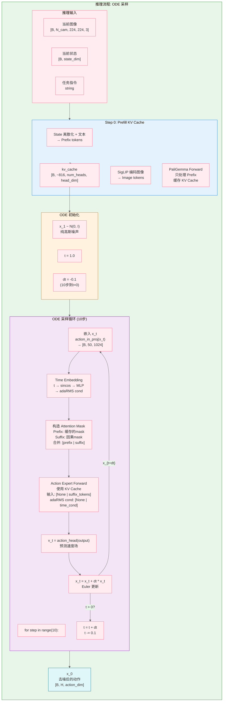

```mermaid
%%{init: {'theme': 'base', 'themeVariables': { 'primaryColor': '#ffecf0', 'primaryTextColor': '#333', 'primaryBorderColor': '#ff6b8a', 'lineColor': '#666', 'secondaryColor': '#e8f5e9', 'tertiaryColor': '#e3f2fd'}}}%%
flowchart TB
    subgraph INFERENCE["推理流程: ODE 采样"]
        direction TB

        subgraph INPUT_INF["推理输入"]
            II1["当前图像<br/>[B, N_cam, 224, 224, 3]"]
            II2["当前状态<br/>[B, state_dim]"]
            II3["任务指令<br/>string"]
        end

        subgraph PREFILL["Step 0: Prefill KV Cache"]
            PC1["State 离散化 + 文本<br/>→ Prefix tokens"]
            PC2["SigLIP 编码图像<br/>→ Image tokens"]
            PC3["PaliGemma Forward<br/>只处理 Prefix<br/>缓存 KV Cache"]
            PC4["kv_cache<br/>[B, ~816, num_heads, head_dim]"]
        end

        subgraph ODE_INIT["ODE 初始化"]
            OI1["x_1 ~ N(0, I)<br/>纯高斯噪声"]
            OI2["t = 1.0"]
            OI3["dt = -0.1<br/>(10步到t=0)"]
        end

        subgraph ODE_STEP["ODE 采样循环 (10步)"]
            direction TB
            OS_ITER["for step in range(10):"]

            OS1["嵌入 x_t<br/>action_in_proj(x_t)<br/>→ [B, 50, 1024]"]

            OS2["Time Embedding<br/>t → sincos → MLP<br/>→ adaRMS cond"]

            OS3["构造 Attention Mask<br/>Prefix: 缓存的mask<br/>Suffix: 因果mask<br/>合并: [prefix | suffix]"]

            OS4["Action Expert Forward<br/>使用 KV Cache<br/>输入: [None | suffix_tokens]<br/>adaRMS cond: [None | time_cond]"]

            OS5["v_t = action_head(output)<br/>预测速度场"]

            OS6["x_t = x_t + dt * v_t<br/>Euler 更新"]

            OS7["t = t + dt<br/>t -= 0.1"]
        end

        OUTPUT_ACT["x_0<br/>去噪后的动作<br/>[B, H, action_dim]"]

        INPUT_INF --> PREFILL
        PREFILL --> PC4

        PC4 --> ODE_INIT
        ODE_INIT --> ODE_STEP

        OS1 --> OS2
        OS2 --> OS3
        OS3 --> OS4
        OS4 --> OS5
        OS5 --> OS6
        OS6 -->|"x_{t+dt}"| OS1
        OS6 -->|"t > 0?"| OS7

        ODE_STEP --> OUTPUT_ACT
    end

    style INFERENCE fill:#e8f5e9,stroke:#2e7d32
    style INPUT_INF fill:#ffecf0,stroke:#ff6b8a
    style PREFILL fill:#e3f2fd,stroke:#1976d2
    style ODE_INIT fill:#fff3e0,stroke:#ef6c00
    style ODE_STEP fill:#f3e5f5,stroke:#7b1fa2
    style OUTPUT_ACT fill:#e0f7fa,stroke:#00838f
```
