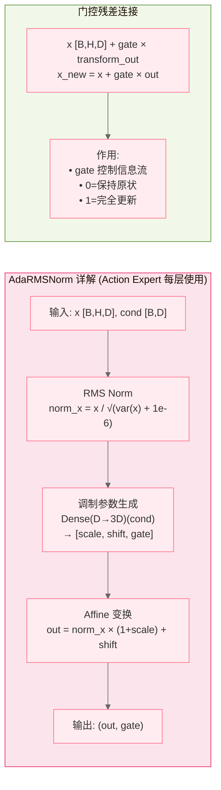

```mermaid
%%{init: {'theme': 'base', 'themeVariables': { 'primaryColor': '#ffecf0', 'primaryTextColor': '#333', 'primaryBorderColor': '#ff6b8a', 'lineColor': '#666', 'secondaryColor': '#e8f5e9', 'tertiaryColor': '#e3f2fd'}}}%%
flowchart LR
    subgraph ADArms["AdaRMSNorm 详解 (Action Expert 每层使用)"]
        direction TB

        ARM1["输入: x [B,H,D], cond [B,D]"]
        ARM2["RMS Norm<br/>norm_x = x / √(var(x) + 1e-6)"]

        ARM3["调制参数生成<br/>Dense(D→3D)(cond)<br/>→ [scale, shift, gate]"]

        ARM4["Affine 变换<br/>out = norm_x × (1+scale) + shift"]

        ARM5["输出: (out, gate)"]
    end

    subgraph GATED_RES["门控残差连接"]
        direction TB

        GR1["x [B,H,D] + gate × transform_out<br/>x_new = x + gate × out"]

        GR2["作用:<br/>• gate 控制信息流<br/>• 0=保持原状<br/>• 1=完全更新"]
    end

    ARM1 --> ARM2 --> ARM3 --> ARM4 --> ARM5
    GR1 --> GR2

    style ADArms fill:#fce4ec,stroke:#e91e63
    style GATED_RES fill:#f1f8e9,stroke:#558b2f
```
