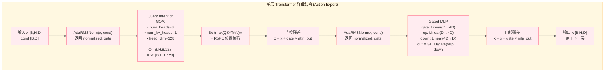

```mermaid
%%{init: {'theme': 'base', 'themeVariables': { 'primaryColor': '#ffecf0', 'primaryTextColor': '#333', 'primaryBorderColor': '#ff6b8a', 'lineColor': '#666', 'secondaryColor': '#e8f5e9', 'tertiaryColor': '#e3f2fd'}}}%%
flowchart LR
    subgraph LAYER_DETAIL["单层 Transformer 详细结构 (Action Expert)"]
        direction LR

        LD1["输入 x [B,H,D]<br/>cond [B,D]"]

        LD2["AdaRMSNorm(x, cond)<br/>返回 normalized, gate"]

        LD3["Query Attention<br/>GQA:<br/>• num_heads=8<br/>• num_kv_heads=1<br/>• head_dim=128<br/><br/>Q: [B,H,8,128]<br/>K,V: [B,H,1,128]"]

        LD4["Softmax(QK^T/√d)V<br/>+ RoPE 位置编码"]

        LD5["门控残差<br/>x = x + gate × attn_out"]

        LD6["AdaRMSNorm(x, cond)<br/>返回 normalized, gate"]

        LD7["Gated MLP<br/>gate: Linear(D→4D)<br/>up: Linear(D→4D)<br/>down: Linear(4D→D)<br/>out = GELU(gate)×up → down"]

        LD8["门控残差<br/>x = x + gate × mlp_out"]

        LD9["输出 x [B,H,D]<br/>用于下一层"]

        LD1 --> LD2 --> LD3 --> LD4 --> LD5 --> LD6 --> LD7 --> LD8 --> LD9
    end

    style LAYER_DETAIL fill:#fff8e1,stroke:#ff8f00
```
