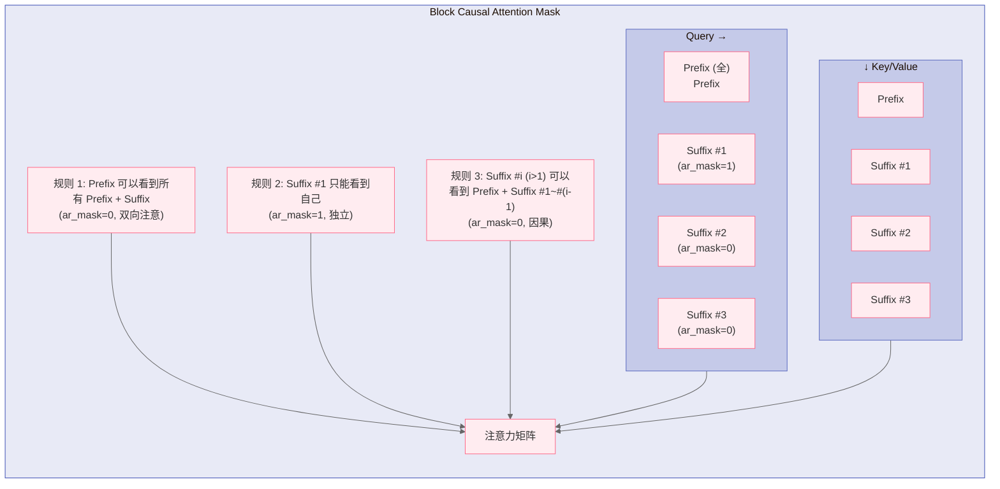

```mermaid
%%{init: {'theme': 'base', 'themeVariables': { 'primaryColor': '#ffecf0', 'primaryTextColor': '#333', 'primaryBorderColor': '#ff6b8a', 'lineColor': '#666', 'secondaryColor': '#e8f5e9', 'tertiaryColor': '#e3f2fd'}}}%%
flowchart TB
    subgraph ATTN_MECH["Block Causal Attention Mask"]
        direction TB

        AM_MATRIX["注意力矩阵"]

        subgraph MATRIX_SHOW["Query →"]
            ROW1["Prefix (全)<br/>Prefix"]
            ROW2["Suffix #1<br/>(ar_mask=1)"]
            ROW3["Suffix #2<br/>(ar_mask=0)"]
            ROW4["Suffix #3<br/>(ar_mask=0)"]
        end

        subgraph COLS["↓ Key/Value"]
            COL1["Prefix"]
            COL2["Suffix #1"]
            COL3["Suffix #2"]
            COL4["Suffix #3"]
        end

        RULE1["规则 1: Prefix 可以看到所有 Prefix + Suffix<br/>(ar_mask=0, 双向注意)"]
        RULE2["规则 2: Suffix #1 只能看到自己<br/>(ar_mask=1, 独立)"]
        RULE3["规则 3: Suffix #i (i>1) 可以看到 Prefix + Suffix #1~#(i-1)<br/>(ar_mask=0, 因果)"]

        MATRIX_SHOW --> AM_MATRIX
        COLS --> AM_MATRIX
        RULE1 --> AM_MATRIX
        RULE2 --> AM_MATRIX
        RULE3 --> AM_MATRIX
    end

    style ATTN_MECH fill:#e8eaf6,stroke:#3f51b5
    style MATRIX_SHOW fill:#c5cae9,stroke:#5c6bc0
    style COLS fill:#c5cae9,stroke:#5c6bc0
```
